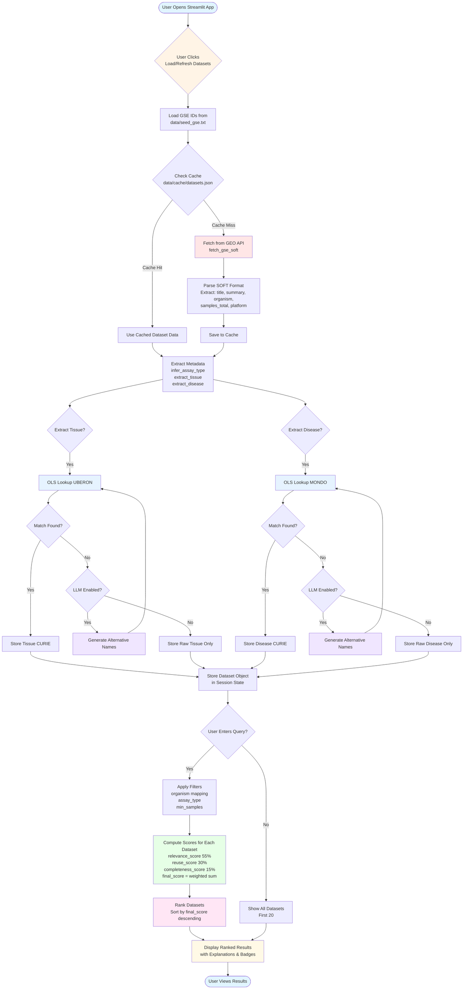

# RNA-seq Dataset Discovery Agent - Data Flow

## Component Details

### Data Ingestion
- **Input**: GSE IDs from `data/seed_gse.txt`
- **Source**: GEO (Gene Expression Omnibus) API
- **Format**: SOFT format text
- **Caching**: Results cached in `data/cache/datasets.json`

### Metadata Extraction
- **Assay Type**: Keyword-based inference (bulk/scRNA/unknown)
- **Tissue**: Simple keyword scanning from title/summary
- **Disease**: Simple keyword scanning from title/summary

### Ontology Normalization
- **Primary**: OLS (Ontology Lookup Service) - no API key needed
  - Tissues → UBERON
  - Diseases → MONDO
- **Fallback**: OpenAI LLM (optional) - generates alternative names
  - Requires OPENAI_API_KEY
  - Only used when OLS lookup fails

### Scoring
- **Relevance Score** (55%): Keyword overlap + ontology matches
- **Reuse Score** (30%): Sample counts/conditions (bulk) or donors (scRNA)
- **Completeness Score** (15%): Metadata fields present
- **Final Score**: Weighted combination

### Filtering & Ranking
- **Filters**: Organism (with common→scientific name mapping), assay type, min samples
- **Ranking**: Sort by final_score descending
- **Output**: Top 20 results with explanations

